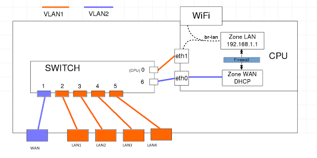
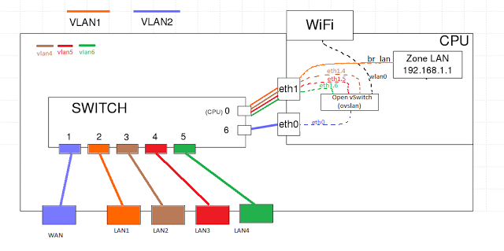

# SDN-openwrt
Running SDN network using openwrt firmware

Default TP-Link router internal diagram (from wiki.openwrt.org):

Create OVS and connect lan2,3,4 and WiFi. Keeping lan1 for OF controller (Recommended settings)

It will completely replace br-lan with OVS and connect all ports to the OVS, if you missed up things, then you have to reset the router or use Serial port.

#First step:
Upgrade TP-Link AC1750 C2 V2 to OpenWRT 15.05 which include OVS switch, or install OVS if you have OpenWRT on your router.

Upgrade firmware if you have openWRT installed:
https://drive.google.com/open?id=0BxgVJIO4HcYFT240SnZjc3RxZTg

Install new firmwire if your router doens't run OpenWRT

https://drive.google.com/open?id=0BxgVJIO4HcYFNjRPV2EwQldmLWM

(Skip this step if you have OpenWRT with ovs installed)

#Second step:
SSH into your tplink router ( ssh root@192.168.1.1)
Make sure WiFi is up.
Copy this script into ovsbr.sh file and then past it there  (vim ovsbr.sh ), press (i), right click -> past, then press (esc), then (:wq).
Add run permission chmod +x ovsbr.sh 
Then run the script
./ovslan.sh 
