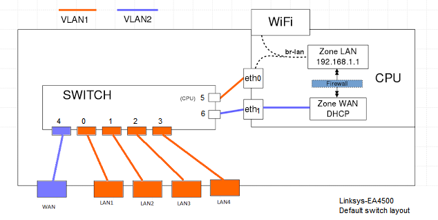
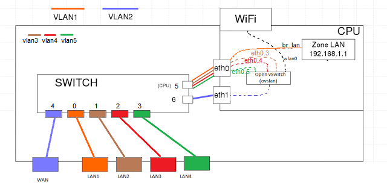

# Running SDN network using OpenWRT firmware
1- Install OpenWRT (follow this [OpenWRT wiki](https://wiki.openwrt.org/toh/linksys/ea4500))
2- Install luci-ssl (Need internet connection through WAN port)
```
opkg update
opkg install luci-ssl
```
3- Install openvswtich-base 
```
opkg install openvswtich-base
```

Now you are ready to go.

# Default settings
Default linksys-EA4500 router internal diagram:


Default /etc/config/network file 
```
root@OpenWrt:~# cat /etc/config/network

config interface 'loopback'
        option ifname 'lo'
        option proto 'static'
        option ipaddr '127.0.0.1'
        option netmask '255.0.0.0'

config globals 'globals'
        option ula_prefix 'fdb0:616b:c995::/48'

config interface 'lan'
        option type 'bridge'
        option ifname 'eth0'
        option proto 'static'
        option ipaddr '192.168.1.1'
        option netmask '255.255.255.0'
        option ip6assign '60'

config interface 'wan'
        option ifname 'eth1'
        option proto 'dhcp'

config interface 'wan6'
        option ifname 'eth1'
        option proto 'dhcpv6'

config switch
        option name 'switch0'
        option reset '1'
        option enable_vlan '1'

config switch_vlan
        option device 'switch0'
        option vlan '1'
        option ports '0 1 2 3 5'

config switch_vlan
        option device 'switch0'
        option vlan '2'
        option ports '4 6'
```

Default /etc/config/wireless
```
root@OpenWrt:~# cat /etc/config/wireless
config wifi-device  radio0
        option type     mac80211
        option channel  11
        option hwmode   11g
        option path     'mbus/mbus:pcie-controller/pci0000:00/0000:00:01.0/0000:01:00.0'
        option htmode   HT20
        # REMOVE THIS LINE TO ENABLE WIFI:
        option disabled 1

config wifi-iface
        option device   radio0
        option network  lan
        option mode     ap
        option ssid     OpenWrt
        option encryption none

config wifi-device  radio1
        option type     mac80211
        option channel  36
        option hwmode   11a
        option path     'mbus/mbus:pcie-controller/pci0000:00/0000:00:02.0/0000:02:00.0'
        option htmode   HT20
        # REMOVE THIS LINE TO ENABLE WIFI:
        option disabled 1

config wifi-iface
        option device   radio1
        option network  lan
        option mode     ap
        option ssid     OpenWrt
        option encryption none

```
# SDN settings
Create OVS and connect lan3,4,5 and WiFi. Keeping lan1 for OF controller (Recommended settings)



# steps
1- SSH into your the router ( ssh root@192.168.1.1) 
2- Make sure WiFi is up. 
3- Create ovs.sh file in the router home directory and copy the content of [ovs.sh](https://github.com/alshaboti/SDN-openwrt/blob/linksys-EA4500/ovs.sh) 
3- Add run permission chmod +x ovsbr.sh  
4- Then run the script 
```
./ovs.sh  
```

/etc/config/network file now looks lik
```
root@OpenWrt:~# cat /etc/config/network

config interface 'loopback'
        option ifname 'lo'
        option proto 'static'
        option ipaddr '127.0.0.1'
        option netmask '255.0.0.0'

config globals 'globals'
        option ula_prefix 'fdb0:616b:c995::/48'

config interface 'lan'
        option type 'bridge'
        option ifname 'eth0'
        option proto 'static'
        option ipaddr '192.168.1.1'
        option netmask '255.255.255.0'
        option ip6assign '60'

config switch
        option name 'switch0'
        option reset '1'
        option enable_vlan '1'

config switch_vlan
        option device 'switch0'
        option vlan '1'
        option ports '0 5'

config switch_vlan
        option device 'switch0'
        option vlan '2'
        option ports '4 6'

config switch_vlan
        option device 'switch0'
        option vlan '3'
        option vid '3'
        option ports '1 0t'

config interface 'lan2'
        option proto 'static'
        option ifname 'eth0.3'

config switch_vlan
        option device 'switch0'
        option vlan '4'
        option vid '4'
        option ports '2 0t'

config interface 'lan3'
        option proto 'static'
        option ifname 'eth0.4'

config switch_vlan
        option device 'switch0'
        option vlan '5'
        option vid '5'
        option ports '3 0t'

config interface 'lan4'
        option proto 'static'
        option ifname 'eth0.5'
```
and /etc/config/wireless is 
```
root@OpenWrt:~# cat /etc/config/wireless

config wifi-device 'radio0'
        option type 'mac80211'
        option channel '11'
        option hwmode '11g'
        option path 'mbus/mbus:pcie-controller/pci0000:00/0000:00:01.0/0000:01:00.0'
        option htmode 'HT20'
        option disabled '0'

config wifi-iface
        option device 'radio0'
        option mode 'ap'
        option ssid 'OpenWrt'
        option encryption 'none'
        option isolate '1'

config wifi-device 'radio1'
        option type 'mac80211'
        option channel '36'
        option hwmode '11a'
        option path 'mbus/mbus:pcie-controller/pci0000:00/0000:00:02.0/0000:02:00.0'
        option htmode 'HT20'
        option disabled '1'

config wifi-iface
        option device 'radio1'
        option network 'lan'
        option mode 'ap'
        option ssid 'OpenWrt'
        option encryption 'none'
```
Note I only use radio0 in this demo. 
